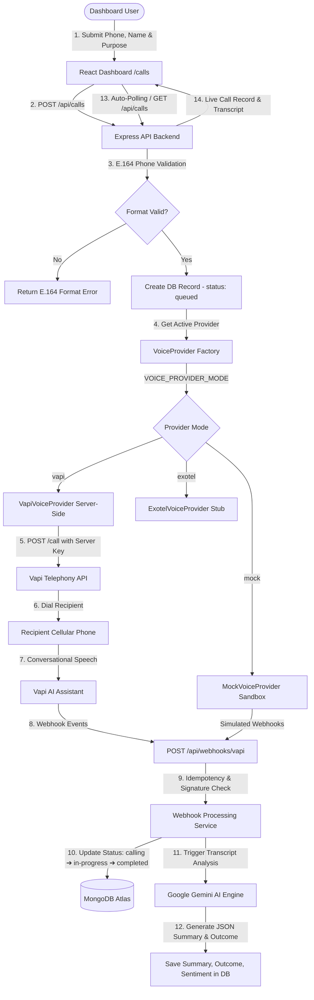

# VoiceCX AI Voice Calling Platform — System Architecture & Flow

This document details the end-to-end architecture, telephony provider abstraction, webhook processing pipeline, and AI summarization engine.

---

## 1. System Architecture Diagram

---

## 2. Telephony Abstraction Architecture (`VoiceProvider`)

The platform implements an abstract interface pattern (`VoiceProvider`) to decouple telephony logic from application logic:

- **`VoiceProvider`** (`server/src/services/voiceProvider/VoiceProvider.js`): Abstract base class defining `createOutboundCall()`, `getCall()`, `handleWebhook()`, and `endCall()`.
- **`VapiVoiceProvider`** (`server/src/services/voiceProvider/VapiVoiceProvider.js`): Server-side implementation interfacing with Vapi REST API (`POST https://api.vapi.ai/call`). Vapi API keys remain strictly server-side.
- **`MockVoiceProvider`** (`server/src/services/voiceProvider/MockVoiceProvider.js`): Sandbox testing provider that simulates complete call lifecycles and transcripts without telecommunication charges.
- **`ExotelVoiceProvider`** (`server/src/services/voiceProvider/ExotelVoiceProvider.js`): Extension stub for future provider expansion.

---

## 3. Idempotent Webhook Processing

- **Endpoint**: `POST /api/webhooks/vapi`
- **Idempotency Key**: Generated from `vapiCallId:eventType:status:transcriptLength`.
- **Duplicate Prevention**: Duplicate payloads are suppressed automatically to prevent multiple database updates or duplicate LLM summarization calls.
- **Fault Tolerance**: If AI summarization encounters an error, the call status remains `completed` while summary generation retries independently.

---

## 4. Environment Variables Reference

| Key | Description | Example / Default |
| --- | --- | --- |
| `VOICE_PROVIDER_MODE` | Telephony Provider Mode (`vapi`, `mock`, `exotel`) | `mock` |
| `VAPI_API_KEY` | Private Vapi API Key (Server-Side Only) | `4a3b...` |
| `VAPI_ASSISTANT_ID` | Vapi Configured Assistant ID | `asst_...` |
| `VAPI_PHONE_NUMBER_ID` | Vapi Registered Phone Number ID | `phone_...` |
| `VAPI_WEBHOOK_SECRET` | Secret token for Vapi webhook signature validation | `secret_...` |
| `GEMINI_API_KEY` | Google Gemini AI API Key for summarization | `AIza...` |
| `DATABASE_URL` | MongoDB Connection URI | `mongodb+srv://...` |
